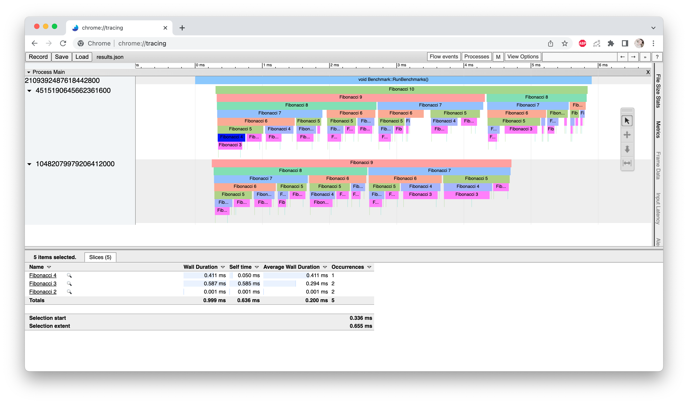

# Instrumentor Timer

[](https://github.com/topics/cpp) [](https://cmake.org/) [](https://github.com/GavinSun0921/InstrumentorTimer/commits)

本项目是根据[TheCherno](https://github.com/TheCherno)大佬编写的[C++的计时器（支持多线程）](https://gist.github.com/TheCherno/31f135eea6ee729ab5f26a6908eb3a5e)的实现，重构了部分代码使得在多线程任务时实现线程安全。

本项目能够对指定代码块或函数等进行计时，并利用Chrome进行可视化，运行截图：



## 如何使用

将[InstrumentorTimer.h](https://github.com/GavinSun0921/InstrumentorTimer/blob/main/InstrumentorTimer.h)和[InstrumentorMacro.h](https://github.com/GavinSun0921/InstrumentorTimer/blob/main/InstrumentorMacro.h)（可选的，一些宏定义）正确引入后。

```C++
Instrumentor::BeginSession("SessionName");               // Begin session 
{
    InstrumentationTimer timer("Profiled Scope Name");   // Place code like this in scopes you'd like to include in profiling
    // Code Blocks
    // timer.Stop();                                     // (Optional) Stop timing manually, timer's destructor will call this function automatically
}
// Instrumentor::EndSession();                           // (Optional) End Session manually, Instrumentor's destuctor will call this function automatically
```

则作用域内的代码会被正确记录到`${SessionName}_Results.json`文件中，在Chrome浏览器中进入[chrome://tracing](chrome://tracing)页面，将该文件拖入即可看到可视化结果。

### 示例

如[Demo.cpp](https://github.com/GavinSun0921/InstrumentorTimer/blob/main/demo.cpp)文件中，在将头文件引入后，在mian函数中调用 `BeginSession()` 函数，之后调用 `Fibonacci()` 函数进行计时，仅需在函数域头部创建 `InstrumentationTimer` 的实例即可开始计时，当希望停止计时时调用该实例的 `Stop()` 函数即可，当作用域完成后该实例销毁，析构函数会检测当前是否已经完成计时，如果没有完成会自动调用 `Stop()` 函数。

```C++
int Fibonacci(int x) {
    std::string name = std::string("Fibonacci ") + std::to_string(x);
  	InstrumentationTimer timer(name.c_str());
  	// PROFILE_SCOPE(name.c_str());     // Available only when include header file 'InstrumentorMacro.h'

	  if (x < 3) return 1;
	  std::cout << "not finished" << std::endl;
 	 	int part1 = Fibonacci(x - 1);
 	 	int part2 = Fibonacci(x - 2);
 	 	return part1 + part2;
}

int main() {
  	Instrumentor::BeginSession("Benchmark");
  	Fibonacci(5);
}
```

## ⚠️注意事项

计时器统计时长的类型为 `std::chrono::microseconds`，即本计时器对小于1微秒的时间开销不敏感。